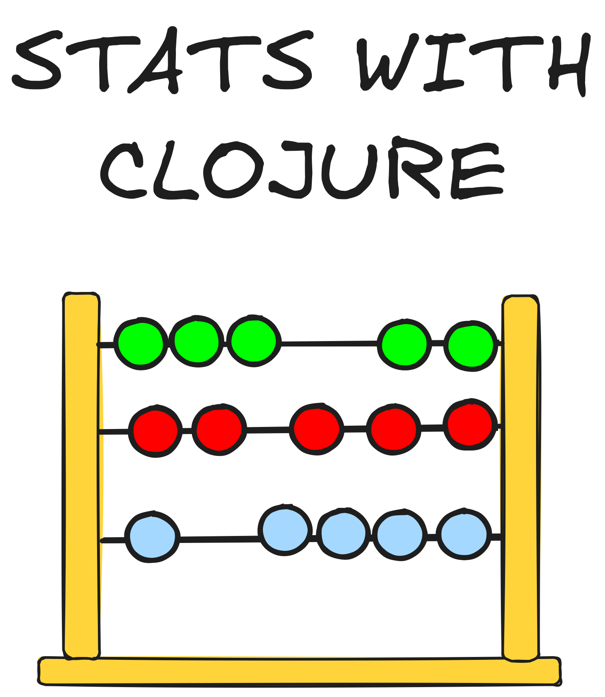

---
format:
  html: {toc: true, toc-depth: 4, theme: quarto}
title: Stats with Clojure
author: Scicloj Team

---
<style></style><style>.printedClojure .sourceCode {
  background-color: transparent;
  border-style: none;
}
</style><style>.clay-limit-image-width .clay-image {max-width: 100%}
.clay-side-by-side .sourceCode {margin: 0}
.clay-side-by-side {margin: 1em 0}
</style>
<script src="https://code.jquery.com/jquery-3.6.0.min.js" type="text/javascript"></script><script src="https://code.jquery.com/ui/1.13.1/jquery-ui.min.js" type="text/javascript"></script>
::: {.clay-image}

```{=html}

```

:::


# Index
- [About This Book](about_this_book.html)
- [Statistics](statistics.html)

## Tooling
- [Setting up Visual Studio Code](setting_up_vscode.html)

## Getting your feet wet
- Cloning Noj v2 Getting Started
- [Start with Clay](start_with_clay.html)
- [Getting Started With Stats With Clojure](getting_started_with_stats_with_clojure.html)

## Noj and other libraries
- Noj
- Kindly
- [Plotly](plotly.html)
- Tablecloth

## Visualizations
- [Visualizations](visualizations.html)

## Statistical Terms
- [Sample and Population](sample_and_population.html)
- [Element](element.html)

## Central Tendencies
- [Mean](mean.html)
- [Median](median.html)
- Mode
   
## Variability
- Range
- Variance
- Standard Deviation
- Interquartile Range
- Distribution

## Project

- [Analysis of Chennai Rainfall](analysis_of_chennai_rainfall.html)

 
## Books & References
- [An Introduction to Statistical Learning](https://www.statlearning.com/) 
- Khan Academy Probability & Statistics Course
- [Information Theory, Inference, and Learning Algorithms](https://www.inference.org.uk/itila/book.html)
- [All of Statistics](https://www.stat.cmu.edu/~brian/valerie/617-2022/0%20-%20books/2004%20-%20wasserman%20-%20all%20of%20statistics.pdf)


```{=html}
<div style="background-color:grey;height:2px;width:100%;"></div>
```


```{=html}
<div><pre><small><small>source: <a href="https://github.com/scicloj/stats_with_clojure/blob/main/notebooks/index.clj">notebooks/index.clj</a></small></small></pre></div>
```
